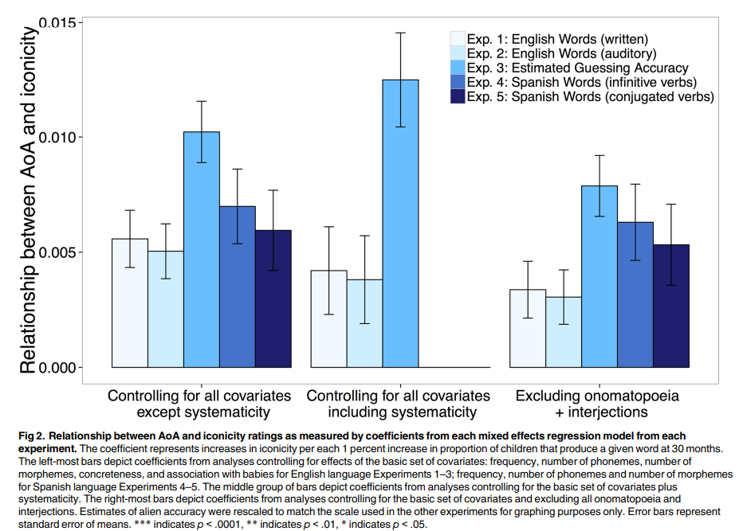

#### Ben Wonderlin
#### LING 234: Quantitative Linguistics 
#### Fall 2023


### 1: Overview

In "Iconicity in English and Spanish and Its Relation to Lexical Category and Age of Acquisition," Perry et al. responded to the common hypothesis that Indo-European languages are "arbitrary outside of a small number of onomatopoeic words." They tested this hypothesis by tasking subjects to rate the iconicity of English and Spanish words in a variety of different contexts. They then built linear mixed effects models that related the subjects' ratings to word characteristics, including age of acquisition and lexical category. They ultimately found that both of these characteristics were significant predictors; most notably, they found that words learned earlier were more iconic, suggesting that iconicity is an "important property" of Indo-European languages.

In this project, I replicate and extend Perry et al.'s methods. Specifically, I reproduce the four main figures (and thus, models) included in the original report. I then use the supplied data to conduct a similar investigation in which word characteristics are used to predict systematicity (rather than iconicity). The resulting linear models demonstrate that age of acquisition is a poor predictor of systematicity. Hence iconicity seems to be the primary form of non-arbitrariness that these characteristics can predict.


### 2: Data

Perry et al. published two datasets alongside their findings. One dataset only contains English words, while the other only contains Spanish words. Both contain a similar set of characteristics (i.e., predictors) for each word. The following two sections describe these characteristics. Unless otherwise specified, the data comes from the MacArthur Bates Developmental Inventory (MCDI), which is an online resource for tracking the language development of children.


#### 2.1 English Data (S1_Data.csv)
- Word: the word being rated
- Subject code: the ID of the subject who supplied the rating (used for random effects)
- Task: the experiment number (1, 2, or 3; see section 2.3 for details)
- Iconicity rating: the rating provided by the subject (see section 2.3)
- Lexical category: the lexical category of the word (noun, verb, adjective, onomatopoeia/adjective, or "function word")
- Age of acquisition: the proportion of children who produce the word at 30 months
- Total phonemes: the number of phonemes (distinct units of sound) in the word
- Total morphemes: the number of morphemes (distinct units of language) in the word
- Frequency: the log-frequency of the word
- Systematicity: the systematicity rating of the word (normally distributed)
- Babyness: the extent to which the word is “associated with babies" (ranges from 1 to 10)


#### 2.2 Spanish Data (S2_Data.csv)
- Word: the word being rated
- Subject code: the ID of the subject who supplied the rating (used for random effects)
- Infinitive form: the infinite form of the word
- Conjugated form: the conjugated form of the word
- Task: the experiment number (4 or 5; see section 2.3)
- Iconicity rating: the rating provided by the subject (see section 2.3)
- English word: the unique English translation of the word, if any
- Lexical category: the lexical category of the word (noun, verb, adjective, onomatopoeia/adjective, or "function word")
- Age of acquisition: the proportion of children who produce the word at 30 months
- Total phonemes: the number of phonemes in the word
- Total morphemes: the number of morphemes in the word
- Frequency: the log-frequency of the word


#### 2.3 Iconicity Ratings

As implied in the previous sections, Perry et al. collected iconicity ratings in a number of different experiments or "tasks." The first three were conducted with English words and native English speakers, while the last two were conducted with Spanish words and native Spanish speakers. These experiments are described below

- Experiment 1 (English, Written): Participants viewed a word, said the word aloud, and then provided an iconicity rating between -5 and 5 (where a 5 corresponded to high iconicity)
- Experiment 2 (English, Auditory): Participants viewed a word, listened to a native speaker say the word, and then provided an iconicity rating between -5 and 5.
- Experiment 3 (English, Estimated Guessing Accuracy or "Alien"): Participants viewed a word, said the word aloud, and then estimated how "accurately a space alien could guess the meaning of [the] word based only on its sound." The estimates were between 0 and 100.
- Experiment 4 (Spanish, Infinitive): Same as Experiment 1, but with Spanish. The verbs were left in the infinitive form.
- Experiment 5 (Spanish, Conjugated): Same as Experiment 1, but with Spanish. The verbs were conjugated.


```{r,echo=FALSE,warning=FALSE,message=FALSE,Setup}

library("tidyverse")
library("RColorBrewer")
library("languageR")
library("GGally")
library("car")
library("arm")
library("patchwork")

s1_data = read_csv("./data/S1_Data.csv")
s2_data = read_csv("./data/S2_Data.csv")

```
 
 

### 3: Replication

In this section, I replicate the figures and models included in the original report. Fortunately, Perry et al. included their model definitions in an appendix, so few details are left to guesswork. However, a non-trivial amount of data wrangling is involved.

#### 3.1: Figure One (Iconicity vs. Lexical Category & Task)

##### 3.1.1: Original Figure

{width=85%}<br><br>

##### 3.1.2: Replicated Figure

```{r F1a}

compute_error = function(rating) {
  return( sd(rating) / sqrt(length(rating)) )
}

task_one = s1_data %>%
  filter( task == "alien" ) %>%
  mutate( rating = scales::rescale(rating, to = c(0, 5) )) %>%
  group_by(task, lexicalCategory) %>%
  summarize(mean = mean(rating), error = compute_error(rating), .groups = 'drop' )

task_two_and_three = s1_data %>%
  filter( task != "alien" ) %>%
  group_by(task, lexicalCategory) %>%
  summarize(mean = mean(rating), error = compute_error(rating), .groups = 'drop' )


task_three_and_four  = s2_data %>% 
  group_by(task, lexicalCategory) %>%
  summarize(mean = mean(rating), error = compute_error(rating), .groups = 'drop' )


figure_one_data = bind_rows( task_one, task_two_and_three, task_three_and_four) %>%
  mutate(task = factor(task, levels = c("written", "auditory", "alien", "infinitive", "conjugated"))) %>%
  mutate(lexicalCategory = factor(lexicalCategory, levels = c("onomatopoeia and interjections", "adjective", "verb", "noun", "function")))
  
head(figure_one_data)
    
```

```{r F1b}

ggplot(figure_one_data, 
        aes(fill = task, x = lexicalCategory, y = mean, ymin = mean - error, ymax = mean + error)) + 
        geom_bar(position = "dodge", stat = "identity", color = "Black" ) + 
        geom_errorbar(position = "dodge") +
        labs(x = "Lexical Category", y = "Mean Rating", title = "Figure One Replication") + 
        scale_fill_manual(values = brewer.pal(5, "Blues"))

```
<br><br>

#### 3.2: Figure Two (Iconicity vs. Age of Acquisition)

##### 3.2.1: Original Figure

{width=85%}<br><br>

##### 3.2.2: Replicated Figure

```{r,warning=FALSE,message=FALSE,F2a}

# define table columns

group = c()
task = c()
coef = c()
error = c()


# fit models for experiments on English data

groups = c("control_partial", "control_all", "control_partial_exclude")
tasks = c("written", "auditory", "alien")

for(group_idx in 1:length(groups)){
  for(task_idx in 1:length(tasks)){
    
    # get right data for task
  
    tmp_data = s1_data %>%
      filter(task == tasks[task_idx])
    
    if (task_idx == 3){
      tmp_data = tmp_data %>%
        mutate(rating = scales::rescale(rating, to = c(0, 10)))
    }
    
    # control for right variables (according to group)
    
    if(group_idx == 1){
      tmp_data$residRating = resid(
        lmer(
          rating ~ logFreq + concreteness + phonemes + totalMorphemes + babyAVG + (1|subjCode),  
          data = tmp_data, 
          na.action = na.exclude
        )
      )
    }
    else if (group_idx == 2){
     tmp_data$residRating = resid(
        lmer(
          rating ~ logFreq + concreteness + phonemes + totalMorphemes + babyAVG + systematicity + (1|subjCode),  
          data = tmp_data, 
          na.action = na.exclude
        )
      )
    }
    else{
      tmp_data = subset(tmp_data, lexicalCategory != "onomatopoeia and interjections")
      tmp_data$residRating = resid(
        lmer(
          rating ~ logFreq + concreteness + phonemes + totalMorphemes + babyAVG + (1|subjCode),  
          data = tmp_data, 
          na.action = na.exclude
        )
      )
    }

    # fit model and append coefs to array

    model = lmer(residRating ~ X30mos + (1|subjCode), data = tmp_data)
    model_summary = summary(model)

    group = c(group, groups[group_idx])
    task = c(task, tasks[task_idx])
    coef = c(coef, model_summary$coefficients[2, 1])
    error = c(error, model_summary$coefficients[2, 2])
    
  }
  
}
```


```{r,warning=FALSE,message=FALSE,F2b}

# fit models for experiments on English data (same as prev. block, but with different data)

groups = c("control_partial", "control_partial_exclude")
tasks = c("infinitive", "conjugated")


for(group_idx in 1:length(groups)){
  for(task_idx in 1:length(tasks)){

    tmp_data = s2_data %>%
      filter(task == tasks[task_idx])
    
    tmp_data$residRating = resid(
      lmer(
        rating ~ logFreq + phonemes + morphemes + (1|subjCode),  
        data = tmp_data, 
        na.action = na.exclude
      )
    )
    
    
    if (group_idx == 1){
      tmp_data$resid_rating = resid(
        lmer(
          rating ~ logFreq + phonemes + morphemes + (1|subjCode),  
          data = tmp_data, 
          na.action = na.exclude
        )
      )
    }
    else {
      tmp_data = subset(tmp_data, lexicalCategory != "onomatopoeia and interjections")
      tmp_data$residRating = resid(
        lmer(
          rating ~ logFreq + phonemes + morphemes + (1|subjCode),  
          data = tmp_data,
          na.action = na.exclude
        )
      )
    }
    
    
    model = lmer(residRating ~ X30mos + (1|subjCode), data = tmp_data)
    model_summary = summary(model)
    
    group = c(group, groups[group_idx])
    task = c(task, tasks[task_idx])
    coef = c(coef, model_summary$coefficients[2, 1])
    error = c(error, model_summary$coefficients[2, 2])
    
  }
}
```

```{r F2c}

# pad cols to make up for missing experiments 

group = c( group, "control_all", "control_all" )
task = c( task, "infinitive", "conjugated" )
coef = c( coef, 0, 0 )
error = c( error, 0, 0 )

figure_two_data = tibble(group, task, coef, error)

figure_two_data = figure_two_data %>%
  mutate(group = factor(group, levels = c("control_partial", "control_all", "control_partial_exclude"))) %>%
  mutate(task = factor(task, levels = c("written", "auditory", "alien", "infinitive", "conjugated")))

head(figure_two_data)

```


```{r F2d}

ggplot(figure_two_data, 
        aes(fill = task, x = group, y = coef, ymin = coef - error, ymax = coef + error)) + 
        geom_bar(position = "dodge", stat = "identity", color = "Black" ) + 
        geom_errorbar(position = "dodge") +
        labs(x = "Group", y = "Relationship between AoA and Iconicity", title = "Figure Two Replication") + 
        scale_fill_manual(values = brewer.pal(5, "Blues"))

```
<br><br>

#### 3.3: Figure Three (Iconicity vs. Age of Acquisition for Translation Pairs)

##### 3.3.1: Original Figure

{width=70%}<br><br>

##### 3.3.3: Replicated Figure

```{r F3a}

english_aoa = s1_data %>%
  filter(task == "written") %>%
  dplyr::select(word, rating, X30mos) %>%
  group_by(word) %>%
  summarize(english_iconicity = mean(rating), english_aoa = mean(X30mos))

spanish_aoa = s2_data %>%
  dplyr::select(word, rating, X30mos, english) %>%
  group_by(word) %>%
  summarize(spanish_iconicity = mean(rating), spanish_aoa = mean(X30mos), english = max(english))

paired_data = inner_join(english_aoa, spanish_aoa, by = c("word" = "english"))

head(paired_data)

```


```{r F3b}

lm1 = lm(english_iconicity ~ english_aoa + spanish_aoa, data = paired_data)
lm2 = lm(spanish_iconicity ~ english_aoa + spanish_aoa, data = paired_data)

iconicity = c("english", "english", "spanish", "spanish")
AoA = c("english", "spanish", "english", "spanish")
coef = c( summary(lm1)$coefficients[2:3, 1], summary(lm2)$coefficients[2:3, 1] )
error = c( summary(lm1)$coefficients[2:3, 2], summary(lm1)$coefficients[2:3, 2])

figure_three_data = tibble(AoA, iconicity, coef, error)

head(figure_three_data)
```


```{r F3bc}

ggplot(figure_three_data, 
        aes(fill = AoA, x = iconicity, y = coef, ymin = coef - error, ymax = coef + error)) + 
        geom_bar(position = "dodge", stat = "identity", color = "Black" ) + 
        geom_errorbar(position = "dodge") +
        labs(x = "Iconicity", y = "Relationship between AoA and Iconicity", title = "Figure Three Replication") +
        scale_fill_manual(values = brewer.pal(3, "Blues"))

```
<br><br>


#### 3.4: Figure Four (Iconicity vs. Age of Acquisition Line Plots)

##### 3.4.1: Original Figure

{width=85%}<br><br>

##### 3.4.2: Replicated Figure

```{r,warning=FALSE,message=FALSE,F4a}


plot_line_f4 = function(data, exp_num){
  
  ggplot(tmp_data, aes(x = X30mos, y = residRating)) +
  stat_smooth(method = "lm", level = 0.68) + 
  xlim(20, 100) + 
  labs(title = sprintf("Experiment %d", exp_num), x = "% of Children Saying Word at 30mos", y = "Residual Iconicity")
  
}


tmp_data = s1_data %>% 
  filter(task == "written") 

tmp_data$residRating = resid(
  lmer(
    rating ~ logFreq + concreteness + phonemes + totalMorphemes + babyAVG + concreteness + (1|subjCode),
    data = tmp_data,
    na.action = na.exclude
  )
)

pl1 = plot_line_f4(tmp_data, 1)


tmp_data = s1_data %>%
  filter(task == "auditory")

tmp_data$residRating = resid(
  lmer(
    rating ~ logFreq + concreteness + phonemes + totalMorphemes + babyAVG + concreteness + (1|subjCode),
    data = tmp_data,
    na.action = na.exclude
  )
)

pl2 = plot_line_f4(tmp_data, 2)


tmp_data = s1_data %>% 
  filter(task == "alien") 

tmp_data$residRating = resid(
  lmer(
    rating ~ logFreq + concreteness + phonemes + totalMorphemes + babyAVG + concreteness + (1|subjCode),  
    data = tmp_data, 
    na.action = na.exclude
  )
)

pl3 = plot_line_f4(tmp_data, 3)


tmp_data = s2_data %>% 
  filter(task == "infinitive") 

tmp_data$residRating = resid(
  lmer(
    rating ~ logFreq + phonemes + morphemes + (1|subjCode),  
    data = tmp_data, 
    na.action = na.exclude
  )
)

pl4 = plot_line_f4(tmp_data, 4)


tmp_data = s2_data %>% 
  filter(task == "conjugated") 

tmp_data$residRating = resid(
  lmer(
    rating ~ logFreq + phonemes + morphemes + (1|subjCode),  
    data = tmp_data, 
    na.action = na.exclude
  )
)

pl5 = plot_line_f4(tmp_data, 5)


```

``````{r,warning=FALSE,message=FALSE,F4b}

layout = "
AB
C#
DE
"

pl1 + pl2 + pl3 + pl4 + pl5 + plot_layout(design = layout) + plot_annotation(title = "Figure Four Replication")
```
<br><br>

#### 3.5: Replication Discussion 

I was able to accurately replicate most of the figures and models. There were a couple of discrepancies, though. The first was that the error bars in figure one did not match those of the original plot. This was especially apparent for the bars from experiment three. Given that this discrepancy was minor, and that the other bars were correct, it seems likely that it was caused by the re-scaling of ratings. Perry et al. did not specify how they scaled the ratings from experiment three, so I had to guess their method. 

The second discrepancy was that the bar heights in figure three did not match those of the original plot. This was especially apparent for the lighter-colored bars. My table of one-to-one translation pairs had more entries than described in the paper (423 vs. 412), so it seems likely that this discrepancy was caused by the joining criteria between the English and Spanish datasets. (Some words, such as `where`, had multiple potential translation pairs). Again, Perry et al. did not specify how to join the datasets, so I had to guess their method. Hence I submit that both discrepancies were minor and were likely caused by inaccurate guesswork.

The replication thus had the same findings as the original report. First, iconicity significantly varied across lexical categories; onomatopoeia were rated as more iconic than all other lexical categories (`p < 0.0001`), and adjectives & verbs more rated as more iconic than nouns & function words (`p < 0.0001`). Second, age of acquisition was a significant predictor of iconicity, regardless of the predictors that were controlled or excluded (`p < 0.0001`, `p = 0.05`, and `p = 0.01`). Third, for both English and Spanish, age of acquisition was a significant predictor of iconicity if the age of acquisition matched the target language. (In other words, English AoA predicted English iconicity but Spanish AoA did not, and vice-versa.) The p-values for this finding were incorrect due to the aformentioned discrepancy, but Perry et al. reported `p < 0.001`, `p = 0.7`, `p < 0.01`, and `p = 0.11`.

As Perry et al. discussed, these findings (somewhat controversially) imply that iconicity has an important role in Indo-European languages; if these languages were truly arbitrary, then these significant relationships would not exist. The are a few specific implications, too. For one, the clear relationship between iconicity and age of acquisition might imply that iconicity exists to aid word learning. Additionally, the use of a continuous scale in measuring iconicity might also imply that a binary conception of iconicity is incomplete. Regardless, Perry et al. aptly pointed out that although these findings reveal the prevalence of iconicity, they do not reveal the mechanisms that cause the iconicity in the first place. This is one limitation that can be addressed in future work.


### 4: Extension (Systematicity vs. Age of Acquisition)

To extend the original report, I conduct a experiment that attempts to predict systematicity, rather than iconicity, using age of acquisition and various word characteristics. The goal of this extension is to determine whether age of acquisition affects types of non-arbitrariness other than iconicity (i.e., systematicity). This finding can inform future investigations into the mechanisms that cause iconicity, especially those that examine the role of iconicity in word learning.

To conduct this experiment, I first group the English dataset by `word`. (I only consider the English dataset because the Spanish dataset does not contain systematicity ratings.):


```{r Ea}

extension_data = s1_data %>% 
  drop_na() %>%
  dplyr::select(word, lexicalCategory, X30mos, phonemes, concreteness, logFreq, systematicity, babyAVG) %>%
  group_by(word) %>%
  summarize(
    systematicity = mean(systematicity),
    lexicalCategory = max(lexicalCategory),
    X30mos = mean(X30mos),
    phonemes = mean(phonemes),
    concreteness = mean(concreteness),
    logFreq = mean(logFreq),
    babyAVG = mean(babyAVG)
  )


feature_data = extension_data %>% 
  dplyr::select(lexicalCategory, X30mos, phonemes, concreteness, logFreq, babyAVG)

head(feature_data)

```
<br>
I then construct a pair plot so that I can identify a set of non-colinear features that includes age of acquisition (`X30mos`). This yields the feature set containing age of acquisition, lexical category, and log-frequency, since all of the other features are significantly correlated with age of acquisition. (Note that these collinearities do not undermine the results of Perry et al. because these features were used as controls. Thus the model only generated residuals and it's coefficients were not considered.):

```{r,warning=FALSE,message=FALSE,Eb}
feature_data %>% 
  ggpairs(., lower = list(continuous = wrap("smooth_loess", size = 0.5)))
```
<br><br>
I then build two linear models: one that contains age of acquisition, and one that does not. The latter will be used to test for significance:

```{r Ec}
extension_lm_null = extension_data %>%
  lm(systematicity ~ lexicalCategory + logFreq ,
     data = .)

extension_lm = extension_data %>%
  lm(systematicity ~ lexicalCategory + logFreq + X30mos ,
     data = .)
```

<br><br>
Next, I check model assumptions. Both models seem adequate. The residuals vs. fitted plots are flat and the leverage plots are within the contours. The q-q residual plots and the scale-location plots aren't ideal -- mostly due to a few extreme values in the tails -- but they seem good enough to proceed. (It might be prudent to examine and exclude these extreme values, but this is not something I look into.)


```{r Ed}

par(mfrow = c(2, 2))
plot(extension_lm_null)

```
```{r Ee}

par(mfrow = c(2, 2))
plot(extension_lm)

```
<br><br>
Next, I check for collinearity. The VIF are less than 10, indicating low collinearity, while the condition number is 12, indicating medium collinearity. The feature set passes the correlation test (because that's how I chose it), so I ultimately proceed without eliminating features:


```{r Ef}
vif(extension_lm)
```


```{r,warning=FALSE,message=FALSE,Eg}
collin.fnc(extension_data %>% dplyr::select(X30mos, logFreq))$cnumber
```
<br><br>
Finally, I replicate Perry et al.'s methods by running an ANOVA comparison between the two models. This reveals that the model including age of acquisition does not outperform the null model `p = 0.14 > 0.05`. Hence age of acquisition is not a significant predictor of systematicity.

```{r Eh}
anova(extension_lm_null, extension_lm)

```
<br><br>
I visually confirm this result by plotting the residuals of the null model vs. age of acquisition:

```{r Ei}
extension_data$resids = resid( extension_lm_null )

extension_data %>%
  ggplot(aes(x = X30mos, y = resids)) + 
  geom_point() +
  stat_smooth(method = "lm") + 
  labs(title = "Residual Systematicity vs. Age of Acquisition", x = "% of Children Saying Word at 30mos", y = "Residual Systematicity")
```

<br><br>
The result is that age of acquisition does not predict systematicity. This demonstrates that the relationship between iconicity and age of acquisition is unique in that other forms of non-arbitrariness (e.g., systematicity) are not more common in early-acquired words. In other words, it seems like age of acquisition can predict iconicity, but not non-arbitrariness *in general*. This could be interpreted as evidence that iconicity's role in Indo-European languages is to aid word learning (simply because the relationship is unique). Hence this finding motivates further investigation into this interpretation of Perry et al.'s results.

Of course, it goes without saying that other interpretations are possible. It may be that age of acquisition influences iconicity by a mechanism that is completely independent from word learning. However, the fact that age of acquisition is uniquely predictive of one type of arbitrariness (iconicity) and not the other (systematicity) suggests that iconicity is closely related to how children learn words.


### 4: Conclusion 

In this project, I replicated and extended Perry et al.'s methods. Specifically, I reproduced the four main figures included in the original report. I then used the supplied data to build linear models and show that age of acquisition has no relationship to systematicity. Together, these efforts suggest that iconicity has an important role in Indo-European languages and may be related to how children learn words.

### 5: References

Perry LK, Perlman M, Lupyan G (2015) Iconicity in English and Spanish and Its Relation to Lexical Category and Age of Acquisition. PLoS ONE 10(9): e0137147. [https://doi.org/10.1371/journal.pone.0137147](https://doi.org/10.1371/journal.pone.0137147)

### 6: Appendix

To see all of the files associated with this project, please visit [https://github.com/BenWonderlin/linguistics_final](https://github.com/BenWonderlin/linguistics_final).
All code (including silenced chunks and package requirements) can be found in `benwo_final.Rmd`.